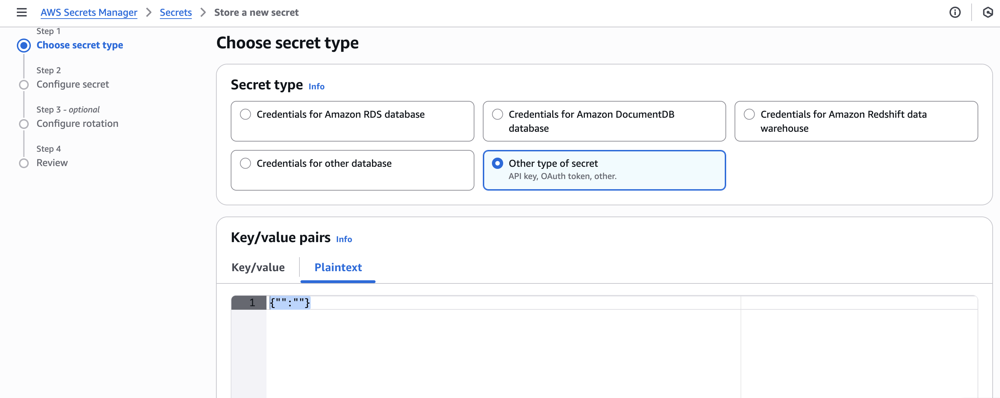
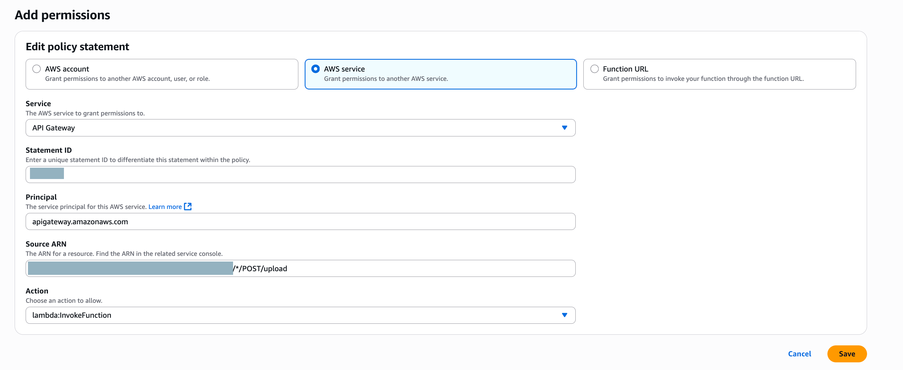

# Building a Secure File Upload Solution: Integrating Google Drive with Amazon Q Business Custom Plugins using API Gateway and Lambda

This solution addresses common challenges organizations face when managing file operations across cloud storage systems, such as maintaining security compliance, managing user permissions, and reducing the technical barriers for users. By leveraging the natural language understanding capabilities and custom plugins available in Amazon Q, organizations can transform Google Drive operations into simple, conversation-based interactions while supporting proper authentication and access controls. The solution demonstrates the power of combining agentic AI capabilities of Amazon Q Business with enterprise storage systems to create a more efficient and user-friendly file management experience. 

This solution demonstrates how Amazon Q Business custom plugin can be used to upload a text file to shared drive in Google Drive.

## What You Will Learn

By following this tutorial, you will gain hands-on experience with:

- Creating an Amazon Q Business application with proper IAM roles and permissions for custom plugin integration
- Setting up a Google Drive data source with customized configuration and domain-wide delegation
- Configuring Google Workspace service accounts with appropriate API scopes and authentication
- Building AWS Lambda functions for file upload processing with permission validation
- Creating Amazon API Gateway endpoints with Cognito authorization and OpenAPI specifications
- Implementing Amazon Cognito user pools with Google federated identity integration
- Managing shared drives in Google Drive with proper user and service account permissions
- Securely storing Google service account credentials using AWS Secrets Manager
- Developing custom plugins for Amazon Q Business with OAuth 2.0 authentication flows
- Working with OpenAPI schemas for both API Gateway and Q Business plugin definitions
- Implementing multi-layer security with role-based access control and permission validation
- Managing AWS IAM Identity Center users and groups for enterprise authentication

## Architecture Overview


The following is a summary of the functionality of the architecture:

* The UI for the chatbot is built using an Amazon Q Business web experience.
* The user authentication and authorization are handled by AWS IAM Identity Center.
* Relevant actions are identified based on natural language queries from the users using Amazon Q Business custom plugins. Amazon Q Business uses the configured third-party OpenAPI specifications to dynamically determine which API operations to perform to fulfill an end user request. Additionally, the API calls are authorized using Cognito authorizer which uses Google federated identity for authorization
* The APIs are implemented using Amazon API Gateway and AWS Lambda functions.
* The Lambda Function has the logic to check if the authorized user has the necessary permissions to upload a file to the folder mentioned in the query and calls the Google service by leveraging the service account credentials stored in AWS Secrets Manager to upload the file to Google Drive.

# Quick Start
**Note**: This solution requires proper AWS service configuration and Google Workspace setup. Ensure all prerequisites are met before deployment.

## Prerequisites

* [Create an AWS account](https://portal.aws.amazon.com/gp/aws/developer/registration/index.html) if you do not already have one.
* The [AWS Identity and Access Management (IAM)](https://aws.amazon.com/iam) user that you use must have permissions to make the necessary AWS service calls and manage AWS resources mentioned in this post. While providing permissions to the IAM user, follow the [principle of least-privilege](https://docs.aws.amazon.com/IAM/latest/UserGuide/best-practices.html#grant-least-privilege).
* You must enable [AWS IAM Identity Center](https://docs.aws.amazon.com/singlesignon/latest/userguide/get-set-up-for-idc.html).
* As a prerequisite to deploying this solution, you will need to set up [Google Workspace Account](https://workspace.google.com/business/signup/welcome?source=gafb-lp_business-hero-en&hl=en&ga_region=noram&ga_country=us&ga_lang=en&uj=&uj=gafb-lp_business-def-en). If you already have these set up, you can use your existing account.  
* Amazon Q Business Pro licenses. This is required to use custom plugins functionality. For pricing information, visit the [Amazon Q pricing page](https://aws.amazon.com/q/pricing/), where Pro licenses start at $20 per user per month.
* **Python 3.8 or higher** installed on your local machine for Lambda function development. Download from [python.org](https://www.python.org/downloads/) or install via package manager:
  - **macOS**: `brew install python`
  - **Windows**: Download installer from python.org
  - Verify installation by running the following commands.
  - `python3 --version`
  - `pip3 --version`

## Setting up Google Workspace Configuration:

Before we can integrate the Google Drive functionality into our Amazon Q Business solution, we first need to set up the necessary configurations within the Google Workspace environment. This setup process will involve creating a service account, enabling the required APIs, and configuring the appropriate permissions and access controls.

1. Log in to the [Google API console](https://console.cloud.google.com/welcome) as an admin user.

   

2. Click the button to the left of the search box and click on New Project
  
   

3. Provide the Project name and choose the organization

   

4. Once the project is created, from the left side navigation menu search for APIs and Services and click on Enabled APIs and services.

   

5. Click on the button + Enable APIs and services .

   

6. Scroll to find Google Workspace and enable Google Drive API and Admin SDK APIs

   

   

7. The next step is to create Service Account. From the left navigation menu, search for IAM & Admin and Click on Service Accounts.

   

8. Click on + Create Service account.

   

9. Enter the service account name, service account ID, and description, and choose Done. Make note of the service account email, this will be used to share the folders in Google Drive to the service account, this is needed because the files are uploaded to the folder as a service account.

   

10. Click on the service account email, Click on Keys tab, and click on Add key and click on Create new key. Make a note of this private key as we are going to use it to create a secret in the secret manager in the next steps.

   

11. The next step is to do Domain wide delegations, login to the admin console by clicking on [admin.google.com](http://admin.google.com/), provide the admin email address with which you setup the Google Workspace account, search for security from the left side menu and search for Access and data control and click on API controls. Click on Manage Domain Wide Delegation and click on Add new.

   

12. From the private key created on the service account, find the Client ID and paste it in the Client ID field and Add the following comma delimited API scopes to OAuth scopes field.

   

   

Add the following comma delimited API scopes and click on Authorize

```
https://www.googleapis.com/auth/drive.readonly,
https://www.googleapis.com/auth/drive.metadata.readonly,
https://www.googleapis.com/auth/admin.directory.group.readonly,
https://www.googleapis.com/auth/admin.directory.user.readonly,
https://www.googleapis.com/auth/cloud-platform
```

   

## 2. User Creation in Google Workspace:

With the Google Workspace configuration completed, the next step is to create the test user accounts that will be used to demonstrate the file upload capabilities of our solution. Having these test users set up in the Google Workspace will allow us to validate the end-to-end functionality of the integration.

1. In the admin console from directory choose Users and click on Add new user
  
  

2. Add two users test user1 as shown below and repeat the same process for test user2:

   

These two users will be used to test the access control/permissions to upload file to shared drive in Google Drive.

## 3. Create a shared drive folder in Google Drive:

Login to Google Drive by signing in as test user1 and create a shared drive as "Q Business Uploads" and keep a note of the shared drive id which can be found from the URL. 

   

For the users to successfully upload the file to this shared drive, this drive should be shared with the Service account email you made note of earlier with Manager permission and change the logged in user permission to Content manager.

   

The next step is to configure users in AWS, open your AWS management console and proceed with the next steps.

## 4. Configure users and permissions on AWS

With the Google Workspace configuration completed, the next step is to create the test user accounts that will be used to demonstrate the file upload capabilities of our solution. Having these test users set up in the Google Workspace will allow us to validate the end-to-end functionality of the integration.

### Configuring Users:

Create 2 new users within IAM Identity Center matching the Google Drive user details.
1. Go to IAM Identity Center by searching it on the search bar in AWS Management Console.
2. Add test user1 as shown below.

   

Choose "Next", "Next" on subsequent steps and then click "Add User".

Follow these steps for creating testuser2.

## 5. Create a secret for Google Service Account Credentials in Secrets Manager:

To facilitate the integration between AWS and Google Drive, store the service account credentials that will be used by the Lambda function to interact with the Google Drive API in [AWS Secrets Manager](https://aws.amazon.com/secrets-manager/).

1. The next step is to create a secret for service account credentials  in Secrets Manager. Go to Secrets Manager and create a new secret by selecting Other type of secret and in Plaintext copy paste the JSON private key generated for the service account in Google Workspace and create a secret. 

   

2. Once the secret is created successfully, make a note of the secret ARN, we are going to use this in some of our next steps.

   

## 6. Create Q Business application:

With the necessary configurations in place for both Google Workspace and AWS, the next step is to create the Amazon Q Business application that will serve as the user interface for the file upload solution.

1. From the management console, search for Amazon Q Business and click on Get Started. Create a new application, choose Authenticated Access and the Access Management method as IAM Identity Center and choose the users you configured in IAM Identity center as part of the previous step and provide the subscription as Q Business Pro.

   

## 7. Configure Cognito, Lambda and API Gateway:

The next step is to configure Amazon Cognito for user authentication, set up the AWS Lambda function that will handle the file upload logic, and integrate the API Gateway to provide the necessary API endpoints.

### Configuring Cognito:

The first step is to set up the Amazon Cognito user pool and associated app client. This will serve as the authentication mechanism for the solution, ensuring that only authorized users can access and interact with the file upload capabilities.

1. Create a user pool in Cognito as shown below

   

2. Configure an App client in the userpool as show below

   

3. Go to Branding, Click on Domains and edit the Cognito domain Branding version and select Hosted UI (classic) and Save changes. Make note of the Cognito domain, you will use this to configure the Authorized redirect URIs in Google Workspace in the next steps.

   

4. The next step is to create OAuth Credentials in Google Workspace and configure Authorized Redirect URIs. For this you need to complete OAuth consent screen by going back to the [Google API console](https://console.cloud.google.com/welcome)  and choosing OAuth consent screen from APIs and Services. Follow these instructions to configure [OAuth consent screen](https://developers.google.com/apps-script/guides/cloud-platform-projects#completing_the_oauth_consent_screen). Now let us create the OAuth credentials. Go back to APIs and Services and search for Credentials. Add a new credential for OAuth client ID.

   

5. Select application type as Web application. Provide a name and add Authorized Redirect URIs as the Cognito domain you made a note of previously and append oauth2/idpresponse. Once the credential is created successfully, make note of the Client ID and Client secret, we are going to use them in the next step where we configure Google as an Identity Provider in cognito.

   

6. On AWS Console for Cognito, search for Social and external providers and configure Identity provider as Google, Copy paste the Client ID and Client secret you made note of earlier and Authorized scopes as profile email openid, make sure these scopes are separated with spaces. Under attributes, map email, name and username to the Google attributes.

   

   

7. Come back to the App client, choose Login Pages tab and click on Edit Login Page, provide the Allowed callback URLs as your Q business application web deployed URL and append the text /oauth/callback to it. Under Identity provider choose Google and OAuth 2.0 grant types as “Authorization code grant” and from OpenID connect scopes choose Email, OpenID and Profile.

   

### Configure Lambda Function:

AWS Lambda function, will contain the core logic for validating user permissions, interacting with the Google Drive API, and ultimately uploading the files to the designated folder.

1. On your local, open Code Editor such as VS Code and create a folder with name "lambda_function". Make this folder as your current working directory.

2. Create a new text file with name as 'requirements.txt' which has the details of the dependencies necessary for the lambda funcion that can be referred from `requirements.txt`.

3. Run the command `pip3 install -r requirements.txt -t .`
4. Verify if the dependencies are installed by running the following command
`ls -la requirements.txt`.
5. Create a new python file named “lambda_function.py” to add the code for the lambda function that can be referred from `lambda_function.py`

   This Lambda function has the logic to get the service account credentials from the secrets manager you configured as part of the previous steps and check if the user trying to upload the file to a particular folder has access to the folder and then allow them to perform the upload action. Once, the permissions are validated the function makes calls to the Google Drive service to upload a file with particular file name and content in the folder id mentioned.

6. Zip your folder with the dependency files and the Lambda function using the following command.

`zip -r lambda-deployment-package.zip . -x "*.git*" "README.md"`

7. On the AWS Management console, Go to Lambda functions, create a new function.

   

8. On the Function overview page, click on Upload form button and click on .zip file and choose the zip folder you just created. 

   

### Configure Environment variables for the function:

1. Create Environment variables as mentioned below:

Please make sure to fill in the below placeholders with the following details in the Lambda function.

   Key - COGNITO_USER_POOL_ID 
   Value - `<your-cognito-userpool-id>` - user pool id from Cognito


   Key - REGION_NAME 
   Value - `<your-region>` - your AWS region like ‘us-east-1’ 


   Key - SECRET_NAME
   Value-  `<your-serviceaccount-credentials-secret arn>` - ARN of the secret for google service account credentials stored in Secrets Manager

   


### Provide necessary permissions to lambda function to access Secrets Manager and Cognito:

1. From the Permissions tab, click on the Lambda execution role and Add permissions for the lambda function to read Cognito user details and read  secrets from the secrets manager.

2. Click on the customer managed policy that starts as AWSLambdaBasicExecutionRole.
   

3. Click on Edit and Choose JSON option for editing the policy.

   

4. Add the below two statements to the policy. 

```
{
   "Effect": "Allow",
   "Action": [
         "secretsmanager:GetSecretValue"
   ],
   "Resource": "<your-serviceaccount-credentials-secret arn>"
},
{
   "Effect": "Allow",
   "Action": [
         "cognito-idp:AdminGetUser"
   ],
   "Resource": "<your-cognito-userpool-arn>"
}

```
Make sure to fill in the below placeholders with the following details.

`<your-serviceaccount-credentials-secret arn>` - ARN of the secret for google service account credentials stored in Secrets Manager
`<your-cognito-userpool-arn>` - ARN of Cognito user pool


5. Once you make these changes the entire policy should look something like this. Click on Next and Cick on Save changes.

```
{
	"Version": "2012-10-17",
	"Statement": [
		{
			"Effect": "Allow",
			"Action": "logs:CreateLogGroup",
			"Resource": "arn:aws:logs:<your-region>:<your-aws-account-id>:*"
		},
		{
			"Effect": "Allow",
			"Action": [
				"logs:CreateLogStream",
				"logs:PutLogEvents"
			],
			"Resource": [
				"arn:aws:logs:<your-region>:<your-aws-account-id>:log-group:/aws/lambda/<your-lambda-function-name>:*"
			]
		},
		{
         "Effect": "Allow",
         "Action": [
            "secretsmanager:GetSecretValue"
         ],
         "Resource": "<your-serviceaccount-credentials-secret arn>"
      },
      {
         "Effect": "Allow",
         "Action": [
            "cognito-idp:AdminGetUser"
         ],
         "Resource": "<your-cognito-userpool-arn>"
      }
	]
}
```
6. On the Lambda function, go back to the Code tab and Click on Deploy.

7. Capture the Lambda function ARN from the Function Overview, we are going to use this in configuring the API Gateway in the next steps.


### Configure API Gateway:

This step will involve defining the API resource, configuring the appropriate request and response models, and integrating the Lambda function as the backend logic.

1. Go to API Gateway console. Click "Create API" and choose "REST API" and Choose "Import from OpenAPI" . Paste the OpenAPI schema for the API that can be referred from `api-gateway-spec.yaml`

(replace `{region}` and `{your-lambda-arn}` with your values) 

Click "Import".

2.  After importing: Go to the /upload POST method, Verify the Lambda function integration as shown in the screenshot below.


3. The next step is to deploy the API Click "Actions" > "Deploy API"

4. Create a new stage (e.g., "Prod").

5. Let us now add Cognito Authorizer, Go to Authorizers from the left side menu and click on Create authorizer. Provide Authorizer name, choose Authorizer type as Cognito, search for the Cognito user pool and mention Authorization in Token source.

   

6. Go back to your API, click on the POST method execution and click on Edit button under Method request.

   

7. Under Authorization, choose Cognito Authorizer you created and define the Authorization scopes as openid, email, profile, aws.cognito.signin.user.admin and save.

   

### Provide necessary permissions to API Gateway to invoke Lambda function:

8. To allow API Gateway to invoke lambda function, we will have to create a resource based policy. Go back to the lambda function. From Permissions tab under configuration, go to Resource-based policy statements and add a policy to allow API gateway to invoke this lambda function. Provide the API Gateway Source ARN for the POST resource as shown below.

   

9. Now, go back to the Code tab and Click on Deploy.

## 8. Create Q Business custom plugin:

The next step is to configure the custom plugin. This custom plugin will serve as the bridge between the end-user's conversational inputs and the underlying AWS and Google Drive services configured throughout this process.

1. On the Amazon Q Business application, Click on Plugins from the left side menu and click on Add plugin.

2. Click on Create custom plugin.

      

3. Provide a Plugin name and description, then choose to define with in-line OpenAPI schema editor and choose YAML and copy paste the Open API schema for the plugin that can be referred from `qbusiness-plugin-spec.yaml`

      

4. Choose Authentication as ‘Authentication required’ and create and add a new secret.

5. Provide a secret name ‘QBusiness-Custom-QGoogleDriveCustomPlugin’ and Client Id as Cognito App client Client ID and Cognito App client Client Secret and OAuth callback url as `<your Q Business Application Deployed URL>/oauth/callback`.

      

6. Ensure "Create and use a new service role" is selected.

     

7. Click on Add plugin.

## Clean up:

If you decide that you no longer require the resources deployed as part of this solution, and you wish to avoid incurring ongoing costs associated with those resources, you can follow the steps outlined below to thoroughly clean up and delete the relevant components. 
1. Downgrade your IAM Identity Center user subscription to Amazon Q. 
2. Delete any Amazon Q related resources, including your Amazon Q Business application.
3. Delete the secrets created for this application from AWS Secrets Manager 
4. Delete the AWS Lambda function. 
5. Delete the API deployed in Amazon API Gateway.
6. Delete the user pool in Amazon Cognito and any other configuration made.


