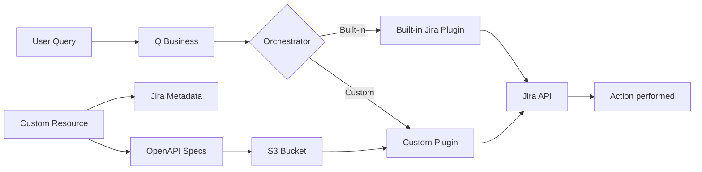

# Amazon Q Business Custom Jira Plugin Sample

> **AWS CDK sample** that creates custom Jira plugins for Amazon Q Business when you need form customization beyond what the built-in Jira plugin provides. Use this when you need to include custom fields, modify form layouts, or create project-specific issue creation workflows that aren't supported by the standard Jira integration.

## What This Does

Creates custom Jira plugins that complement the built-in Jira plugin with enhanced form capabilities:

- **Custom field support**: Include Jira custom fields in your forms (priority, labels, components, etc.)
- **Project-specific workflows**: Tailor forms for specific projects and issue types
- **Enhanced form layouts**: Control which fields appear and how they're presented
- **Natural language integration**: **"Create a high-priority bug in WEBAPP with component 'Authentication'"** → Creates Jira issue with custom fields populated

**Comprehensive Jira Integration:**

- **Built-in Jira plugin**: Automatically configured for all read operations (searching issues, viewing projects, etc.) and standard write operations
- **Custom plugins**: Added for specific issue creation workflows that need enhanced forms
- **Best of both worlds**: Users get full Jira functionality plus your custom form experiences

**When to use this:**

- ✅ You need custom fields in your issue creation forms
- ✅ The built-in Jira plugin's generic forms don't meet your workflow needs
- ✅ You want project-specific or issue-type-specific form layouts
- ✅ You want both comprehensive Jira access AND custom form workflows
- ❌ The built-in Jira plugin already meets all your requirements

## Quick Start

Get up and running in 5 minutes!

### Prerequisites

- **Existing Amazon Q Business application** (this sample adds plugins to an existing app)
- AWS CLI configured with appropriate permissions
- Node.js 18+
- AWS CDK (`npm install -g aws-cdk`)
- Jira API Token
- **Estimated cost**: Plugins require a Q Business Professional license - $20 per month for each user

### 1. Install and Configure

**Option 1: Sparse checkout (Recommended - faster download)**

```bash
# Clone with no checkout
git clone --no-checkout https://github.com/aws-samples/amazon-q-business-samples.git
cd amazon-q-business-samples

# Set up sparse checkout for this project only
git sparse-checkout set code-samples/jira-custom-plugin-automation

# Checkout the content
git checkout main

# Navigate to the project
cd code-samples/jira-custom-plugin-automation
npm install
```

**Option 2: Full repository**

```bash
git clone https://github.com/aws-samples/amazon-q-business-samples.git
cd amazon-q-business-samples/code-samples/jira-custom-plugin-automation
npm install
```

**Configure:**

```bash
cp config.example.json config.json
# Edit config.json with your Jira URL, Q Business app ID, and projects
```

### 2. Create Jira API Secret

**Important**: Create the secret in the same AWS region where you'll deploy the CDK stack.

```bash
aws secretsmanager create-secret \
  --name "jira-api-key" \
  --secret-string '{"email": "your-email@example.com", "apiToken": "your-jira-api-token"}' \
  --region your-deployment-region
```

### 3. Deploy

**Single Environment (Default):**

```bash
npm run deploy
# or
./deploy.sh deploy
```

### 4. Configure OAuth (Post-Deployment)

**Important**: OAuth setup happens AFTER deployment succeeds.

1. **Deploy first** (uses temporary OAuth values)
2. **Get Q Business redirect URI** from AWS Console → Q Business → Your App → Copy Web URL
3. **Create Jira OAuth app** at [Atlassian Developer Console](https://developer.atlassian.com/console/myapps/)
4. **Update the OAuth secret** with real values:
    - Secret name: `jira-oauth-{your-stack-name}` (also shown in CloudFormation outputs)

**That's it!** Your Q Business application now has Jira integration.

## Architecture



**Flow:**

1. **Deployment**: Lambda custom resource queries Jira metadata → generates OpenAPI specs → stores in S3 -> Creates plugin
2. **Runtime**: User prompt → Q Business → Orchestrator → Jira API → Action Performed

**Components:**

- **Q Business**: Natural language interface with plugin routing
- **Built-in Jira Plugin**: AWS-managed Jira integration for comprehensive read/write operations
- **Custom Plugin**: Project-specific Jira integration using generated OpenAPI specs for custom forms
- **Lambda**: Generates OpenAPI specs from your Jira project metadata
- **S3**: Stores OpenAPI specifications

**Plugin Strategy:**

- **Built-in Plugin**: Handles most Jira operations and serves as fallback for unsupported custom plugin actions
- **Custom Plugin**: Optimized for specific project workflows and issue creation patterns
- **Combined Use**: Built-in plugin for reads and complex operations, custom plugins for streamlined issue creation

## Multi-Environment Deployments

The deployment script supports multiple environments and stack names. For detailed multi-environment setup, CI/CD integration, and production best practices, see [DEPLOYMENT_GUIDE.md](DEPLOYMENT_GUIDE.md).

**Quick Examples:**

```bash
# Development environment
./deploy.sh deploy --stack-name dev-jira --environment dev --config config.dev.json

# Production environment
./deploy.sh deploy --stack-name prod-jira --environment prod --config config.prod.json

# Available commands
./deploy.sh help                    # Show all options
./deploy.sh list                    # List deployed stacks
./deploy.sh destroy --stack-name my-stack  # Remove a deployment
```

## Configuration Options

**Complete Configuration Example** (all available fields):

```json
{
    "jiraBaseUrl": "https://your-company.atlassian.net",
    "jiraApiKeySecretName": "jira-api-key",
    "qBusinessApplicationId": "12345678-1234-1234-1234-123456789012",
    "atlassianSiteId": "your-site-id-here",
    "enableBuiltInJiraPlugin": true,
    "enableQBusinessIndex": false,
    "flexibleIssueTypes": ["Bug", "Story", "Task"],
    "metadataProject": "SAMPLE",
    "projects": [
        {
            "key": "WEBAPP",
            "name": "Web Application",
            "issueTypes": ["Bug", "Story"]
        },
        {
            "key": "API",
            "name": "API Services",
            "issueTypes": ["Bug", "Task", "Epic"]
        }
    ]
}
```

**Field Descriptions:**

- `jiraBaseUrl` (required): Your Jira instance URL
- `jiraApiKeySecretName` (optional): AWS Secrets Manager secret name (defaults to "jira-api-key")
- `qBusinessApplicationId` (required): Existing Q Business application ID
- `atlassianSiteId` (optional): Your Atlassian site ID for OAuth
- `enableBuiltInJiraPlugin` (optional): Enable AWS's native Jira integration
- `enableQBusinessIndex` (optional): When set to true, creates a Q Business index and retriever in the specified application
- `flexibleIssueTypes` (optional): Issue types users can create in any project
- `metadataProject` (required if using flexibleIssueTypes): Project to query for field metadata
- `projects` (optional): Pre-configured project/issue type combinations

Choose your plugin style:

### **Built-in Plugin Only** (Easiest)

Uses AWS's native Jira integration:

```json
{
    "jiraBaseUrl": "https://your-domain.atlassian.net",
    "qBusinessApplicationId": "12345678-1234-1234-1234-123456789012",
    "atlassianSiteId": "your-site-id-here",
    "enableBuiltInJiraPlugin": true
}
```

_Provides full Jira functionality through Q Business_

### **Built-in + Custom Flexible Plugins** (Recommended)

Combines AWS's native integration with custom streamlined workflows:

```json
{
    "jiraBaseUrl": "https://your-domain.atlassian.net",
    "qBusinessApplicationId": "12345678-1234-1234-1234-123456789012",
    "atlassianSiteId": "your-site-id-here",
    "enableBuiltInJiraPlugin": true,
    "flexibleIssueTypes": ["Bug", "Story", "Task"],
    "metadataProject": "SAMPLE"
}
```

_Query: "Create a bug in project WEBAPP about login issues"_

### **Built-in + Custom Targeted Plugins**

Pre-configured for specific projects with full Jira functionality:

```json
{
    "jiraBaseUrl": "https://your-domain.atlassian.net",
    "qBusinessApplicationId": "12345678-1234-1234-1234-123456789012",
    "atlassianSiteId": "your-site-id-here",
    "enableBuiltInJiraPlugin": true,
    "projects": [{ "key": "WEBAPP", "name": "Web App", "issueTypes": ["Bug", "Story"] }]
}
```

_Query: "Create a bug in the web app about login issues"_

### **All Plugin Types Combined**

Maximum flexibility with all approaches:

```json
{
    "jiraBaseUrl": "https://your-domain.atlassian.net",
    "qBusinessApplicationId": "12345678-1234-1234-1234-123456789012",
    "atlassianSiteId": "your-site-id-here",
    "enableBuiltInJiraPlugin": true,
    "enableQBusinessIndex": true,
    "flexibleIssueTypes": ["Bug"],
    "metadataProject": "SAMPLE",
    "projects": [{ "key": "WEBAPP", "name": "Web App", "issueTypes": ["Story"] }]
}
```

> **Custom-Only Option**: If you already have the built-in Jira plugin configured in your Q Business application, you can omit `enableBuiltInJiraPlugin: true` from any of the above configurations to add only custom plugins.

### **With Q Business Index and Retriever**

Enable the Q Business index and retriever since the orchestrator will not work without the index enabled:

```json
{
    "jiraBaseUrl": "https://your-domain.atlassian.net",
    "qBusinessApplicationId": "12345678-1234-1234-1234-123456789012",
    "atlassianSiteId": "your-site-id-here",
    "enableBuiltInJiraPlugin": true,
    "enableQBusinessIndex": true
}
```

_Creates a dedicated index and retriever in your Q Business application for improved Jira data access_

## How It Works

1. **Lambda queries your Jira** for project metadata during deployment
2. **Generates OpenAPI specs** for each project/issue type combination
3. **Creates Q Business plugins** that understand your Jira structure
4. **Users make natural language requests** → Q Business calls Jira API → Issues created

## Example Queries

**Flexible plugins:**

- _"Create a bug in project WEBAPP about login issues"_
- _"File a story for project API regarding user authentication"_

**Targeted plugins:**

- _"Create a bug in the web application about login issues"_
- _"File an epic in the API services project for the new feature"_

## Development & Testing

### Quick Validation and Spec Generation

**Validate Configuration:**

```bash
npm run validate     # Validate your config.json structure and logic
```

**Generate Specs from Real Jira Data (Browser Method):**

1. **Get Issue Type ID** - In browser, go to:

    ```
    https://your-domain.atlassian.net/rest/api/3/issue/createmeta/YOUR_PROJECT_KEY/issuetypes
    ```

    Find your issue type and note the `id` field.

2. **Download Field Metadata** - Go to:

    ```
    https://your-domain.atlassian.net/rest/api/3/issue/createmeta/YOUR_PROJECT_KEY/issuetypes/ISSUE_TYPE_ID
    ```

    Save the JSON response as `jira-response.json`.

3. **Test Local Lambda Function:**
    ```bash
    npm run test-local   # Test the Lambda function with your config
    ```

**Alternative with curl (if you have API token):**

```bash
curl -H "Authorization: Basic $(echo -n 'email@example.com:api_token' | base64)" \
     "https://your-domain.atlassian.net/rest/api/3/issue/createmeta/PROJ/issuetypes/10001" \
     > jira-response.json
```

### Full Lambda Testing

**Test Lambda Function Locally:**

```bash
npm run test-local   # Runs the complete Lambda function with your config
```

This command:

- Uses your `config.json` settings
- Requires valid Jira API credentials in AWS Secrets Manager
- Makes actual API calls to your Jira instance
- Generates all configured specs and saves results to `./local-lambda-output/`
- Writes OpenAPI specs locally instead of uploading to S3 (no AWS permissions needed)
- Shows exactly what would happen during deployment

**Development Tools:**

```bash
npm run dev          # Show all available development commands
npm test             # Run unit tests
```

## Security & Architecture

**Authentication:**

- **API Token**: System uses this to collect Jira metadata during deployment
- **OAuth**: End users authenticate via OAuth when creating issues

**Security:**

- All secrets in AWS Secrets Manager
- S3 buckets have public access blocked
- IAM roles follow least privilege
- OAuth ensures proper user attribution

## Customization

Extend this sample by:

- Adding more Jira API endpoints
- Supporting Jira workflows and transitions
- Integrating other Atlassian products

## Troubleshooting

### Quick Fixes

- Run `npm run validate` to check configuration
- Run `npm run test-local` to test without deploying
- Check CloudWatch logs for detailed error messages

### Common Configuration Issues

**Error**: "jiraBaseUrl not found in config.json"

- Ensure `config.json` exists and has `jiraBaseUrl` field
- Check JSON syntax is valid

**Error**: "At least one plugin type must be configured"

- Add at least one plugin type to your configuration
- Built-in plugin: `"enableBuiltInJiraPlugin": true`
- Custom plugins: `"flexibleIssueTypes": ["Bug"]` or `"projects": [...]`

**Error**: "metadataProject is required when flexibleIssueTypes is specified"

- Add `metadataProject` field when using flexible issue types
- Example: `"metadataProject": "SAMPLE"`

### Common Deployment Issues

**Error**: Lambda timeout during deployment

- Large Jira instances may take longer to query
- Check CloudWatch logs: `/aws/lambda/CustomPluginJiraStack-JiraMetadataFunction*`
- Consider reducing number of projects/issue types

**Error**: "Issue type 'X' not found in project Y"

- Verify issue type names match exactly (case-sensitive)
- Check issue type exists in the specified project

**Jira API secret in wrong region**

- Secret must be in the same AWS region as your CDK deployment
- Recreate secret in correct region if needed

### Authentication Issues

**Error**: "Failed to retrieve Jira API credentials"

- Verify secret exists in AWS Secrets Manager
- Ensure secret contains both `email` and `apiToken` fields
- Format: `{"email": "user@example.com", "apiToken": "token"}`

**OAuth authentication fails**

- Check Jira OAuth app configuration
- Verify redirect URI matches Q Business expectation
- Update OAuth secret with correct client_id/client_secret

### Finding Your Atlassian Site ID

1. Go to your Atlassian admin settings
2. Or check the URL when making API calls - it's the UUID in the path
3. Or use: `https://your-domain.atlassian.net/rest/api/3/serverInfo` and look for `cloudId`

### Debugging Steps

1. **Validate Configuration**: `npm run validate`
2. **Test Lambda Locally**: `npm run test-local`
3. **Check CloudWatch Logs**: `/aws/lambda/CustomPluginJiraStack-JiraMetadataFunction*`
4. **Verify S3 Bucket Contents**: `qbusiness-jira-openapi-{account}-{region}`
5. **Test Jira API Connectivity**: Use development tools

### Log Analysis

**Successful Deployment Logs:**

```
✅ Successfully uploaded flexible OpenAPI spec for Bug
✅ Successfully uploaded targeted OpenAPI spec for PROJ - Task
```

**Common Error Patterns:**

- `401 Unauthorized` - Check API token/credentials
- `404 Not Found` - Verify project keys and issue type names
- `Timeout` - Reduce configuration complexity or increase Lambda timeout

### Monitoring

- **CloudWatch logs**: `/aws/lambda/CustomPluginJiraStack-JiraMetadataFunction*`
- **S3 bucket**: `qbusiness-jira-openapi-{account}-{region}`
- **Local test output**: `./local-lambda-output/`

## Cleanup

To remove all resources:

```bash
npx cdk destroy
```

Note: You may need to manually delete the S3 bucket contents if the deployment fails during cleanup.

## Security

See [CONTRIBUTING](CONTRIBUTING.md#security-issue-notifications) for more information.

## License

This library is licensed under the MIT-0 License. See the LICENSE file.
