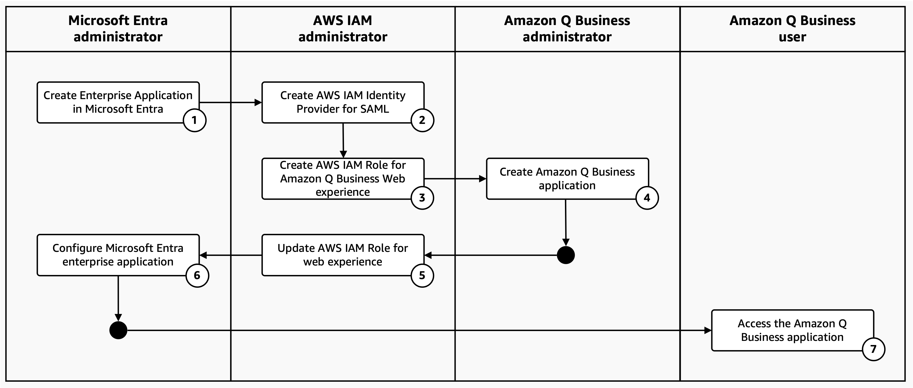
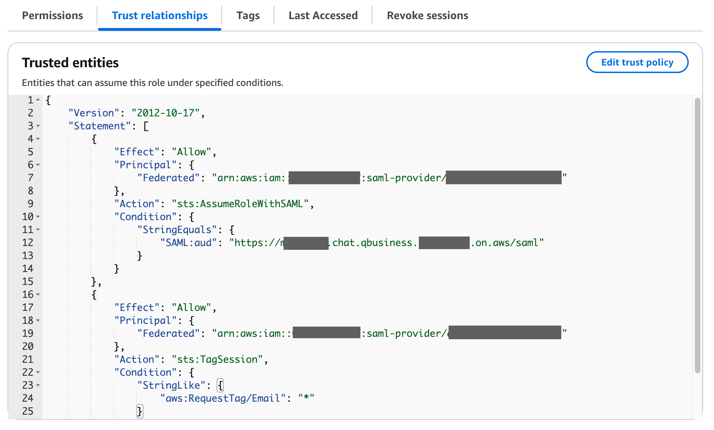
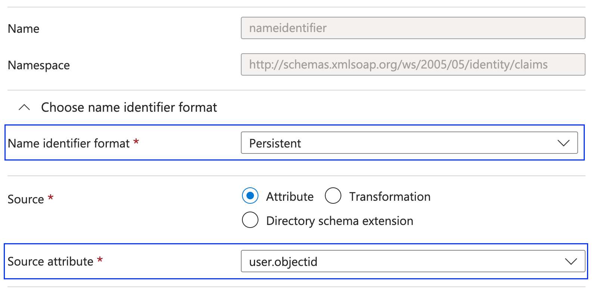
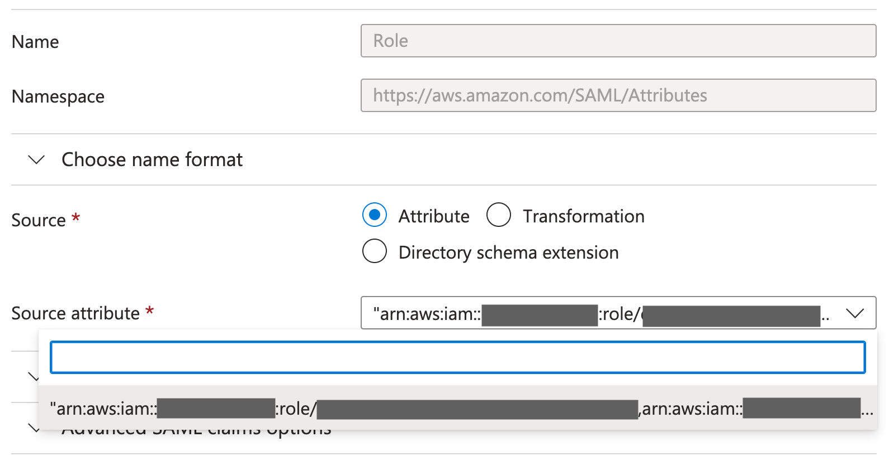
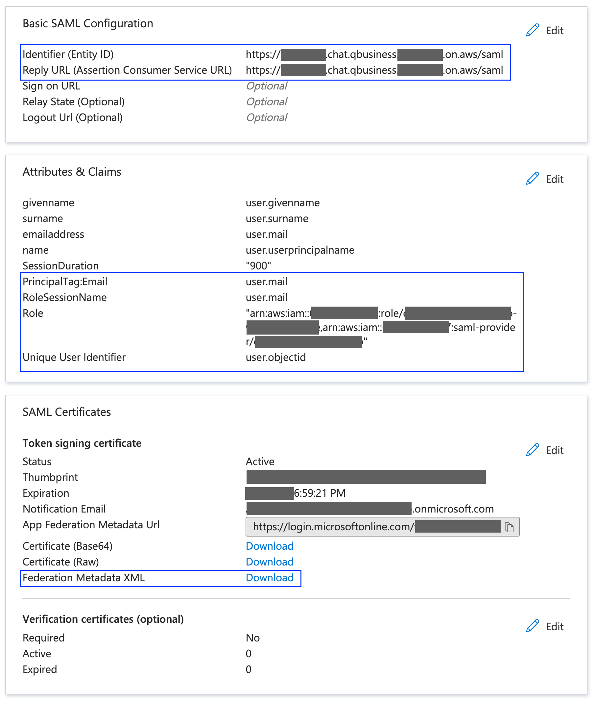

# Configure Amazon Q Business SAML single sign-on using Microsoft Entra and AWS IAM Federation

Learn how to set up SAML-based single sign-on for Amazon Q Business using Microsoft Entra and AWS IAM Federation (AWS IAM Identity Provider).


## Audience
This guide is for Amazon Q Business administrators, Microsoft Entra administrators, solution architects, and developers.


## Prerequisites

- AWS account with AWS Management Console access and permissions to:
    - Manage Amazon Q Business applications
    - Configure AWS IAM Identity Federation providers
    - Create AWS IAM roles and policies
- Microsoft Entra account with permissions to:
    - Manage Enterprise applications
    - [Optional] Manage users and groups


## Required Roles

Setting up Amazon Q Business SAML-based single sign-on requires coordination across multiple roles. While one person with sufficient access privileges may handle all roles during proof-of-concept implementations, typical deployments involve:

- Microsoft Entra administrator
    - Manages identity and access in Microsoft Entra ID (formerly Azure AD).
    - Controls user accounts, authentication policies, and access to Microsoft cloud resources.
- AWS IAM administrator
    - Manages AWS Identity and Access Management services and security policies.
    - Creates and maintains IAM users, groups, roles, and implements least-privilege access across AWS services.
- Amazon Q Business administrator
    - Creates and configures Amazon Q Business applications and manages data source connections.
    - Adds groups and users to access the Amazon Q Business web interface and provisions user subscriptions.
- Amazon Q Business user
    - Uses Amazon Q to obtain AI-powered answers, insights, and collaborate with team members.
    - Accesses information from connected data sources and shares findings through the Amazon Q Business web interface.


## Configuration process



- [Step 1: Create Enterprise Application in Microsoft Entra](#step-1-create-enterprise-application-in-microsoft-entra)
- [Step 2: Create AWS IAM Identity Provider for SAML](#step-2-create-aws-iam-identity-provider-for-saml)
- [Step 3: Create AWS IAM Role for Amazon Q Business web experience](#step-3-create-aws-iam-role-for-amazon-q-business-web-experience)
- [Step 4: Create Amazon Q Business application](#step-4-create-amazon-q-business-application)
- [Step 5: Update AWS IAM Role for web experience](#step-5-update-aws-iam-role-for-web-experience)
- [Step 6: Configure Microsoft Entra enterprise application](#step-6-configure-microsoft-entra-enterprise-application)
- [Step 7: Access the Amazon Q Business application](#step-7-access-the-amazon-q-business-application)


### Step 1: Create Enterprise Application in Microsoft Entra

**Required Role:** Microsoft Entra Administrator

1. Sign in to the [Microsoft Entra console](https://entra.microsoft.com/#home)
1. Create and configure the application:
    - In the left navigation pane, select `Applications` → `Enterprise Applications`
    - Choose `New Application` → `Cloud Platforms` → `Amazon Web Services` → `AWS Single account access`
    - Enter an application name and select `Create`
1. Configure Single Sign-On:
    - From the app overview page, `Set up Single Sign on` → `SAML`
    - Enter an unique _temporary_ `Identifier (Entity ID)` and `Reply URL` (You'll update these with the Q Business web experience URL later)
    - Save your changes
1. Download the metadata:
    - In the `Single Sign-on` page, locate the `SAML Certificates` section
    - Download the `Federation Metadata XML` file
1. Record the single sign-on access URL:
    - Go to the `Properties` page
    - Copy the `User access URL`

> [!IMPORTANT]
> - [ ] Download and save the Federation Metadata XML file
> - [ ] Copy the Entra application user access URL


### Step 2: Create AWS IAM Identity Provider for SAML 

**Required Role:** AWS IAM Administrator

1. Sign in to the [AWS IAM Console](https://console.aws.amazon.com/iam/home)
1. In the left navigation pane, select `Identity Provider` → `Add provider`
1. Choose `SAML` and enter a provider name
1. Upload the Federation Metadata XML file from Entra (obtained in Step 1)
1. Select `Add provider`
1. Copy the `ARN` of the newly created identity provider

> [!IMPORTANT]
> - [ ] Copy the identity provider ARN


### Step 3: Create AWS IAM Role for Amazon Q Business Web experience

**Required Role:** AWS IAM Administrator

1. Sign in to the [AWS IAM Console](https://console.aws.amazon.com/iam/home)
1. In the left navigation pane, select `Roles` → `Create role`
1. Select `Custom trust policy`
1. Configure the trust policy:
    - Copy the following policy
        <details>

        <summary>Trust policy reference</summary>

        See [documentation](https://docs.aws.amazon.com/amazonq/latest/qbusiness-ug/web-experience-iam-role-iam.html) for latest version.

        ```json
        {
            "Version": "2012-10-17",
            "Statement": [
                {
                    "Effect": "Allow",
                    "Principal": {
                        "Federated": "arn:aws:iam::{{account_id}}:saml-provider/[[saml_provider]]"
                    },
                    "Action": "sts:AssumeRoleWithSAML",
                    "Condition": {
                        "StringEquals": {
                            "SAML:aud": "signin.aws.amazon.com/saml"
                        }
                    }
                },
                {
                    "Effect": "Allow",
                    "Principal": {
                        "Federated": "arn:aws:iam::{{account_id}}:saml-provider/[[saml_provider]]"
                    },
                    "Action": "sts:TagSession",
                    "Condition": {
                        "StringLike": {
                            "aws:RequestTag/Email": "*"
                        }
                    }
                }
            ]
        }
        ```

        </details>
    - Replace the IAM identity provider ARN (obtained in Step 2) in the Principal field
    - Select `Next`
1. Skip the permissions assignment (you'll add these later) and select `Next*
1. Enter a role name and select `Create role`
1. Copy the `ARN` of the new IAM role

> [!IMPORTANT]
> - [ ] Copy the web experience IAM Role ARN


### Step 4: Create Amazon Q Business application

**Required Role:** Amazon Q Business Administrator

1. Sign in to the [Amazon Q Business Console](https://console.aws.amazon.com/amazonq/business/applications)
1. In the left navigation pane, select `Applications` → `Create application`
1. Enter an application name
1. Configure access management:
    - For `Access management method`, select `AWS IAM Identity Provider`
    - For `Identity Provider type`, select `SAML`
    - Select the identity provider created in Step 2
    - For `Authentication URL`, enter the `User access URL` from Step 1
1. Configure application settings:
    - Under `Application details`, select one of these options for `Application service access`:
        - Use an existing IAM role
        - Create a new service role
        - Use a service-linked role
    - For `Web experience settings`, select the IAM role created in Step 3
    - Select `Create`
1. Copy the `Application ID` from the `Application settings` section of your new application
1. Copy the `Deployed URL` from the `Web experience settings` section of your new application

> [!IMPORTANT]
> - [ ] Copy the Amazon Q Business application ID
> - [ ] Copy the web experience (deployed) URL


### Step 5: Update AWS IAM Role for web experience

**Required Role:** AWS IAM Administrator

1. Sign in to the [AWS IAM Console](https://console.aws.amazon.com/iam/home)
1. In the left navigation pane, select `Roles` and locate the web experience role created in Step 2
1. Add permissions:
    - Under the `Permissions` tab, select `Add permissions` > `Create inline policy`
    - Copy the latest required permissions from the [documentation](https://docs.aws.amazon.com/amazonq/latest/qbusiness-ug/web-experience-iam-role-iam.html)
    - Update the policy with your:
        - AWS Region
        - Account ID
        - Amazon Q Business application ID
    - Select `Next`
    - Enter a policy name and select `Create policy`
1. Update trust policy:
    - Under the `Trust relationships` tab, select `Edit trust policy`
    - Update the `SAML:aud` value with your web experience URL from Step 4, adding `/saml` at the end
    - See [screenshot-s1](#screenshot-s1-web-experience-iam-role-trust-policy) for reference
    - Select `Update policy`

> [!IMPORTANT]
> - [ ] Verify permissions are complete and up to date
> - [ ] Confirm trust policy audience is set to web experience URL with `/saml` suffix


### Step 6: Configure Microsoft Entra enterprise application

**Required Role:** Microsoft Entra Administrator

1. Sign in to the [Microsoft Entra console](https://entra.microsoft.com/#home)
1. Select `Applications` → `Enterprise Applications`from the left navigation
1. Open Entra application created in Step 1
1. Select `Single sign-on` under `Manage`
1. Update Entity ID and reply URL:
    - Click `Edit` in the `Basic SAML Configuration` section
    - Enter the Amazon Q Business web experience URL (from Step 4) with `/saml suffix` for both `Identifier (Entity ID)` and `Reply URL`
    - Save changes
1. Configure Attributes & Claims:
    - Click `Edit` in the `Attributes & Claims` section
    - Update `Unique User Identifier (Name ID)` claim:
        - Set `Name identifier format` to `Persistent`
        - Set `Source attribute` to `user.objectId`
        - See [screenshot-s2](#screenshot-s2-microsoft-entra-claims---name-id-or-unique-user-identifier) for reference
    - Add new or edit `PrincipalTag:Email` claim:
        - Set `Name` to `PrincipalTag:Email`
        - Set `Namespace` to `https://aws.amazon.com/SAML/Attributes`
        - Set `Source attribute` to `user.mail`
    - Add new or edit `RoleSessionName` claim:
        - Set `Name` to `RoleSessionName`
        - Set `Namespace` to `https://aws.amazon.com/SAML/Attributes`
        - Set `Source attribute` to `user.mail`
    - Add new or edit "Role" claim:
        - Set `Name` to `Role`
        - Set `Namespace` to `https://aws.amazon.com/SAML/Attributes`
        - Set `Source attribute` to literal string `"<web-experience-iam-role-arn>,<iam-identity-provider-arn>"`
        - See [screenshot-s3](#screenshot-s3-microsoft-entra-claims---role) for reference

> [!NOTE]
> - This claims configuration uses the `user.mail` attribute for user email address. Modify the claim to match the appropriate attribute in your Entra setup.

> [!IMPORTANT]
> - [ ] Verify all single sign-on settings including Entity ID, Reply URL, and claims configurations (see [screenshot-s4](#screenshot-s4-microsoft-entra-single-sign-on-settings))


### Step 7: Access the Amazon Q Business application

**Required Role:** Entra-authorized Amazon Q Business user

1. Access Amazon Q Business:
    - Open the Web Experience URL
    - Enter your Entra credentials
    - Access the Amazon Q Business chat interface

## Clean up

Delete all resources created with this guide to prevent additional charges.

1. Delete Amazon Q Business Application and associated IAM roles
1. Delete AWS IAM Identity Provider
1. Delete Microsoft Entra Enterprise application


## References

1. [Amazon Q Business Web Experience AWS IAM Role](https://docs.aws.amazon.com/amazonq/latest/qbusiness-ug/web-experience-iam-role-iam.html)

1. [Creating an Amazon Q Business application using Identity Federation through IAM](https://docs.aws.amazon.com/amazonq/latest/qbusiness-ug/create-application-iam.html)

1. [Troubleshoot SAML federation with AWS IAM](https://docs.aws.amazon.com/IAM/latest/UserGuide/troubleshoot_saml.html)

1. [SAML authentication with Microsoft Entra ID](https://learn.microsoft.com/en-us/entra/architecture/auth-saml)

1. ##### Screenshot-S1: Web experience IAM Role trust policy
    

1. ##### Screenshot-S2: Microsoft Entra Claims - Name ID or Unique User Identifier
    

1. ##### Screenshot-S3: Microsoft Entra Claims - Role
    

1. ##### Screenshot-S4: Microsoft Entra single sign-on settings
    
